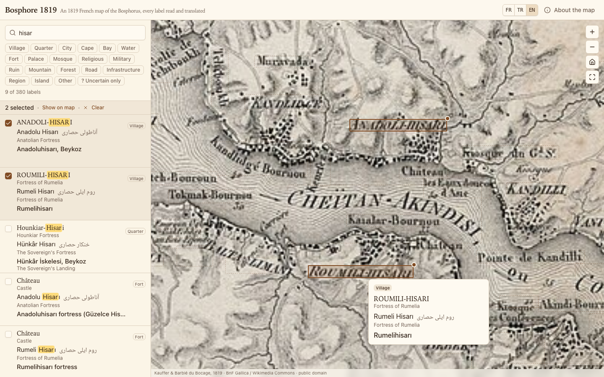

# Bosphore 1819

An 1819 French map of the Bosphorus with every label read, mapped and translated. French original, Ottoman Turkish, and the names we use today.



**Live app:** deploy on Vercel (see below) · **Data:** [`public/labels.json`](public/labels.json)

## The map

*Plan Topographique du Bosphore de Thrace ou Canal de Constantinople et de ses environs.* Surveyed by François Kauffer between 1776 and 1786 while attached to the French embassy of Choiseul-Gouffier and later to the Ottoman Porte, then redrawn and enriched by Jean-Denis Barbié du Bocage for Antoine-Ignace Melling's *Voyage pittoresque de Constantinople et des rives du Bosphore* (1819).

The sheet is not north-up: the Black Sea is on the left, the Sea of Marmara lower right, Europe along the bottom and Asia along the top. Turkish names are written with French spelling conventions of the time (*ou* = u, *tch* = ç, *keui* = köy), so each label is given three ways:

1. **French original**, exactly as engraved, with a literal gloss in the interface language.
2. **Ottoman Turkish**, in Latin letters and in Arabic script (Noto Naskh Arabic), with the meaning of the name.
3. **Modern name**, with the district where that helps, and a note when the place no longer exists.

Readings marked with a `?` are guesses: the engraving is unclear or the identification with a modern place is uncertain.

## Data provenance

- **Scan:** Bibliothèque nationale de France, Gallica, [`ark:/12148/btv1b10100957j`](https://gallica.bnf.fr/ark:/12148/btv1b10100957j), mirrored on [Wikimedia Commons](https://commons.wikimedia.org/wiki/File:Plan_Topographique_du_Bosphore,_de_Thrace_ou_Canal_de_Constantinople_et_de_ses_environs_-_Fr._Kauffer_;_J.D._Barbi%C3%A9_du_Bocage_-_btv1b10100957j.jpg). 12 509 × 7 749 px, 13.5 MB JPEG. The app loads the image straight from Wikimedia (it sends `Access-Control-Allow-Origin: *`) through an OpenSeadragon `legacy-image-pyramid` built from the 1280, 1920 and 3840 px thumbnails plus the full image. The image is **not** redistributed in this repository.
- **Labels:** transcribed from the scan in 54 overlapping chunks by Claude subagents, then reviewed chunk by chunk against overlay renders, then checked for consistency (same place, same spelling everywhere). The record format is in [`pipeline/schema.json`](pipeline/schema.json) and the reading rules in [`pipeline/prompts/ocr.md`](pipeline/prompts/ocr.md).
- **Counts:** 380 labels, of which 153 are flagged uncertain. Bounding boxes are stored as fractions of the full image (`[x, y, w, h]`), so they are independent of which scan resolution is displayed.

## Running it

```sh
pnpm install
pnpm dev          # http://localhost:5173
pnpm build        # static site in dist/
pnpm sizes        # gzipped bundle sizes and the 200 KB first-load budget
pnpm test:e2e     # Playwright smoke test against vite preview (needs: pnpm exec playwright install chromium)
```

The URL carries the state: `?lang=fr|tr|en` for the interface language and `?sel=id1,id2` for the selected labels, so a view can be shared.

## Regenerating the labels

The pipeline lives in `pipeline/` and needs Python 3 with Pillow.

```sh
python3 pipeline/download.py        # fetch the scan -> pipeline/raw/full.jpg (gitignored)
python3 pipeline/chunks.py          # 54 chunk renders with a coordinate grid -> pipeline/out/chunkpng/
python3 pipeline/overview.py        # whole-sheet render for the big region labels
# transcribe: each chunk becomes pipeline/out/chunks/<id>.json (see pipeline/prompts/ocr.md)
python3 pipeline/merge.py           # validate, dedupe, normalise -> public/labels.json
python3 pipeline/overlay.py         # draw every box back on the map -> pipeline/out/qa/ (for review)
python3 pipeline/consistency.py     # spelling / gloss / letterform checks
```

`chunks.py --zoom <id> x y w h` renders any small area at up to 1.5× for hard-to-read text. `thumbs.py` asks the Commons API for the exact thumbnail geometry used in `src/map/pyramid.ts`.

## Contributing corrections

Corrections are very welcome, especially to the Ottoman spellings and the modern identifications. Every label in `public/labels.json` carries a `src` field naming the chunk file it came from.

1. Edit the record in `pipeline/out/chunks/<src>.json` (the big region labels live in `overview.json`). Bounding boxes there are in full-image pixels; use the `--zoom` render to read them off the red grid.
2. Run `python3 pipeline/merge.py` to rebuild `public/labels.json`, and `python3 pipeline/consistency.py` to check it.
3. Open a pull request with both the chunk file and the regenerated `labels.json`.

Please keep `fr` exactly as engraved, use ی and ك (never ي or ک) in Arabic script, and set `uncertain: true` whenever a reading or identification is a guess.

## Stack

Vite + React + TypeScript, Tailwind CSS v4 with shadcn/ui components copied into `src/components/ui`, OpenSeadragon 5 for the deep-zoom viewer, no search library (normalised substring matching over ~400 records), Playwright for the smoke test. First-load JavaScript is under 200 KB gzipped; `labels.json` is fetched separately.

## Deploying

Import the repository in Vercel with the **Vite** framework preset. No environment variables are needed; the output directory is `dist/`.

## Credits and licence

Map: Fr. Kauffer and J.-D. Barbié du Bocage, 1819, in A.-I. Melling, *Voyage pittoresque de Constantinople et des rives du Bosphore*. Scan: BnF Gallica, via Wikimedia Commons. The map is in the public domain.

Code: MIT (see [LICENSE](LICENSE)). Label data: CC0.
